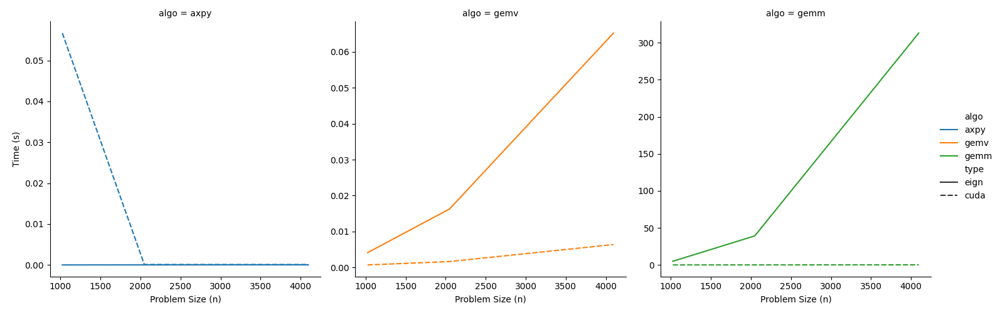

# cuzaoBLAS

Naive C++/CUDA [BLAS](https://en.wikipedia.org/wiki/Basic_Linear_Algebra_Subprograms) type interface (level 1, 2, and 3). I got the idea for this after reading chapter 5 of [1].

Only axpy, gemv, and gemm are implemented. The same operations are written in Eigen for comparison.

## Optimization notes

Both the gemv and gemm cuda kernels make use of tiling and shared memory. These are relatively simple optimizations. See https://github.com/yzhaiustc/Optimizing-SGEMM-on-NVIDIA-Turing-GPUs to see what else can be done, especially for optimizing gemm.

## Performance comparison with Eigen

The file 'timing.cpp' runs each algorithm for varing problem sizes using both CUDA and Eigen. I ran this and plotted the results. My machine has a RTX3070, Ryzen 5600X, and 32GB of ram. The problem size (n) means each dimension is of size (n), i.e (n x n) matrices.

* Axpy shows that CUDA and Eigen are pretty close at least for small vector sizes.
* Gemv shows that CUDA pretty quickly becomes faster than Eigen even for small problem sizes
* Gemm is much faster than Eigen

[1] Wen-Mei, W. Hwu, David B. Kirk, and Izzat El Hajj. Programming Massively Parallel Processors: A Hands-on Approach. Morgan Kaufmann, 2022.
